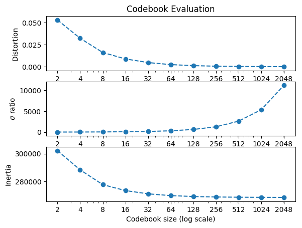
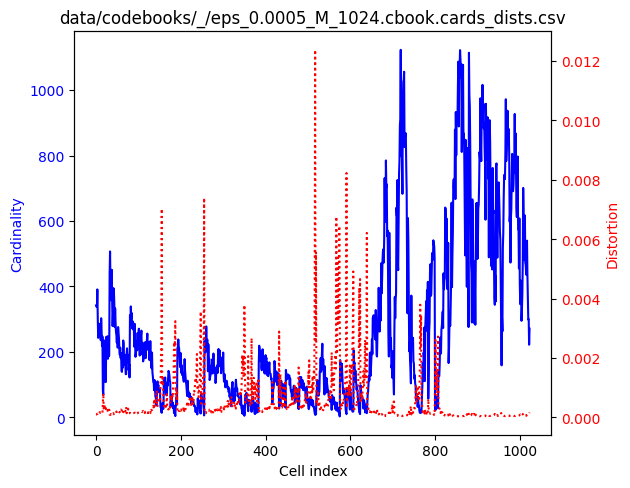
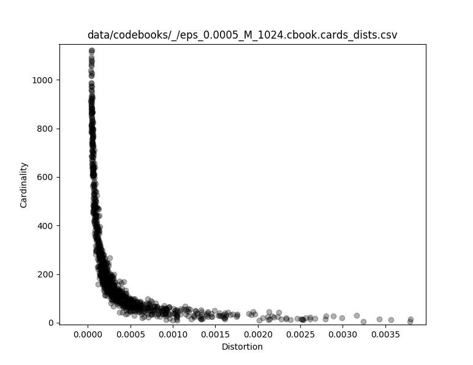
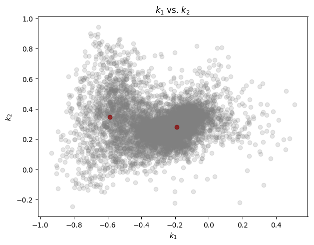
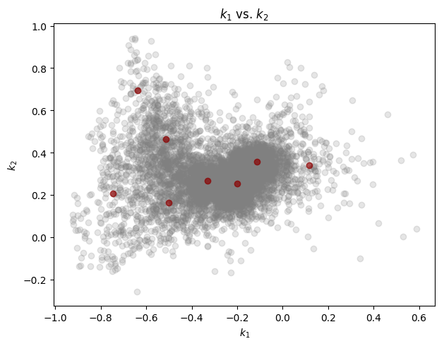
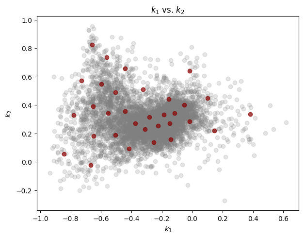
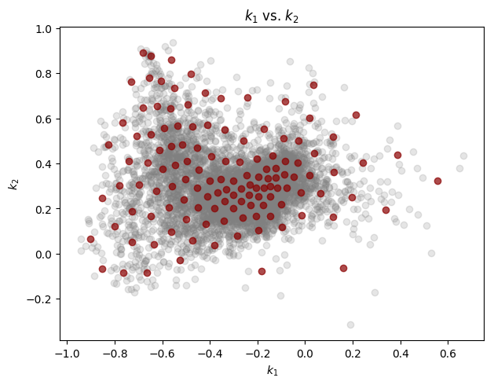
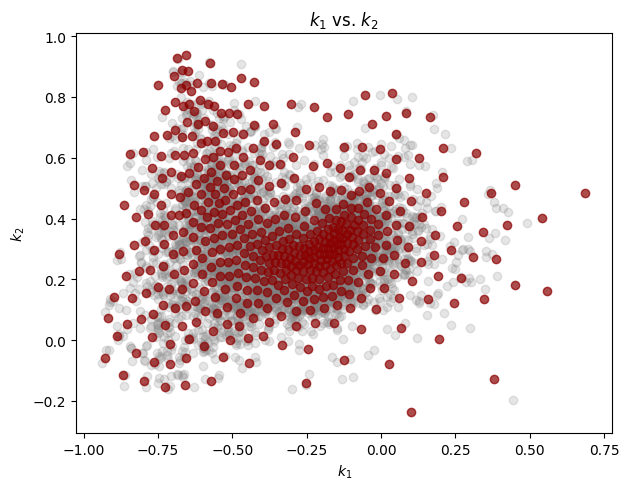
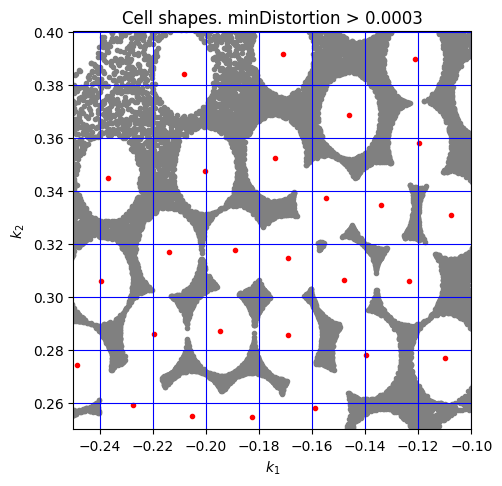
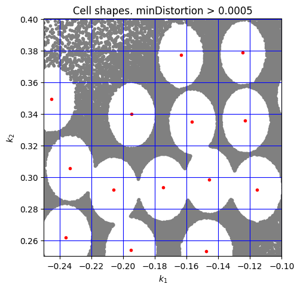

## Cell shapes

In this exercise we also inspect the shape of the clustering cells, also
in the style of Juang et al (1982).
We do this based on a 2-order linear prediction analysis to more directly
reflect the (k_1,k_2) bi-dimensional space.

We start with a similar set of plots as in other exercises and then add
the cell shapes.

## LPC analysis

    $ lpc -P 2 -W 45 -O 15 ~/Desktop/MBARI/Soundscape/HumpbackSong_6_good_songs/*.wav

## Codebook generation
    
    $ vq.learn -P 2 -e 0.0005 data/predictors/HumpbackSong_6_good_songs/*prd
     
Plot the general evaluation:

    $ cb.plot_evaluation.py data/codebooks/_/eps_0.0005.rpt.csv
           M  passes     DDprm             σ        inertia
    0      2      11  0.053156      7.251973  302057.030448
    1      4       6  0.032346     12.428455  288405.598348
    2      8      16  0.016184     37.002063  277843.112889
    3     16      33  0.008903     77.934252  273595.196830
    4     32      20  0.004752    150.256840  271277.345569
    5     64      29  0.002443    306.276237  270009.826839
    6    128      31  0.001254    625.188607  269362.560338
    7    256      29  0.000634   1266.084185  269027.353668
    8    512      33  0.000313   2618.034716  268854.456669
    9   1024      27  0.000155   5359.786386  268769.425495
    10  2048      25  0.000075  11197.921133  268726.206815    
    

    

Cell cardinality and distortions for M=1024:
    
    $ cb.plot_cards_dists.py data/codebooks/_/eps_0.0005_M_1024.cbook.cards_dists.csv
        

As a scatter plot:

    $ cb.plot_cards_dists.py --scatter data/codebooks/_/eps_0.0005_M_1024.cbook.cards_dists.csv

    

Extract  k_1 and k_2 from the training vectors:

    $ for prd in data/predictors/HumpbackSong_6_good_songs/*.prd; do
      prd.show -k -r 1-2 $prd >> k1k2.csv
    done
    
and from the codebooks:

    $ for M in 0002 0004 0008 0016 0032 0064 0128 0256 0512 1024; do
        cb.show -r 1-2 data/codebooks/_/eps_0.0005_M_$M.cbook > data/codebooks/_/eps_0.0005_M_$M.cbook.kk.csv
    done

With the above set of reflection coefficients, let's generate a few "k_1 vs. k_2"
scatter plots:

    $ for M in 0002 0008 0032 0128 0512; do
        cb.plot_reflections.py k1k2.csv data/codebooks/_/eps_0.0005_M_$M.cbook.kk.csv
    done

(Note: A maximum of 8000 training vectors, randomly chosen in each case, are plotted.)

M=2:
 

M=8:

M=32:

M=128:

M=512:

**Cell shapes**

Finally, let's visualize the cell shapes in some codebooks.

In the following:

- gray points represent training vectors whose minimum distortion wrt to 
  corresponding codebook size is greater than the indicated threshold
- red dots are a subset of centroids from the codebook
  

minDistortion > 0.0003, M=256: 

    $ cb.plot_cell_shapes.py \
      k1k2.csv \
      data/codebooks/_/eps_0.0005_M_0256.cbook.min_dists.csv \
      data/codebooks/_/eps_0.0005_M_0256.cbook.kk.csv \
      0.0003

minDistortion > 0.0005, M=128:

    $ cb.plot_cell_shapes.py \
      k1k2.csv \
      data/codebooks/_/eps_0.0005_M_0128.cbook.min_dists.csv \
      data/codebooks/_/eps_0.0005_M_0128.cbook.kk.csv \
      0.0005

