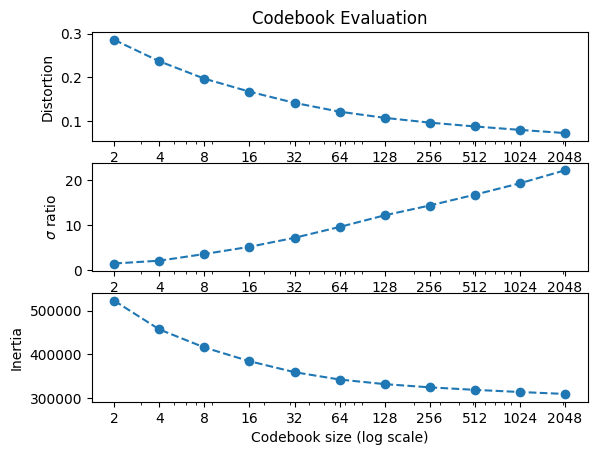
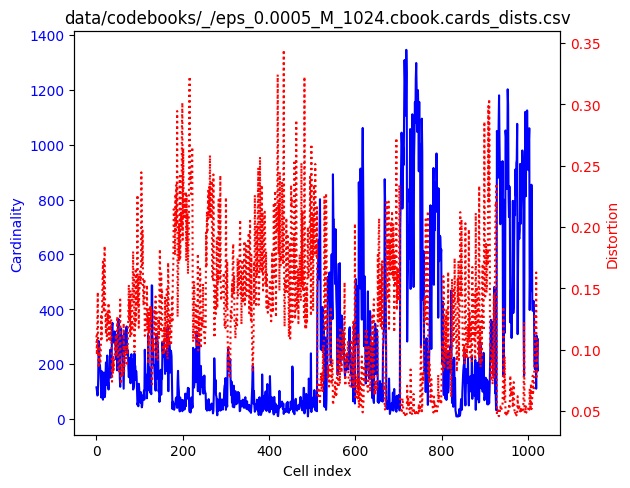
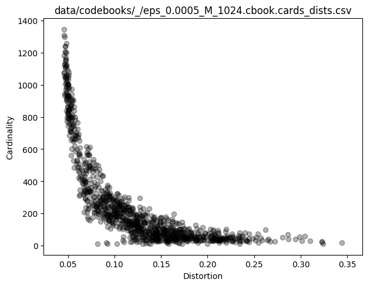
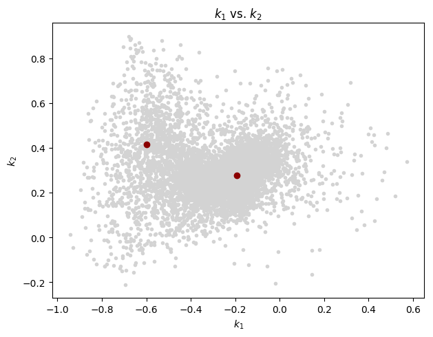
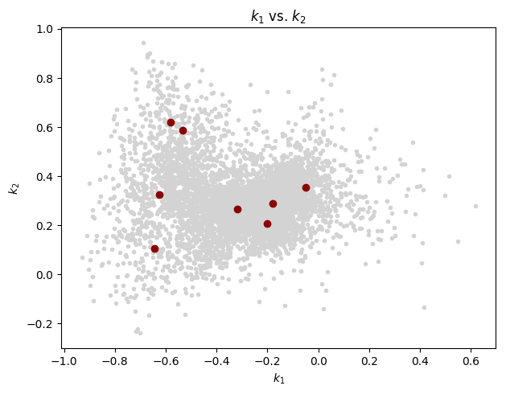
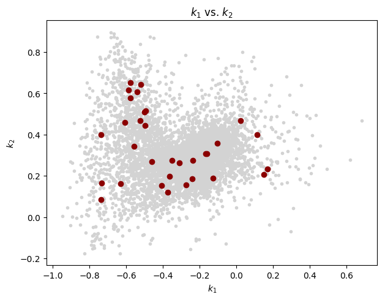
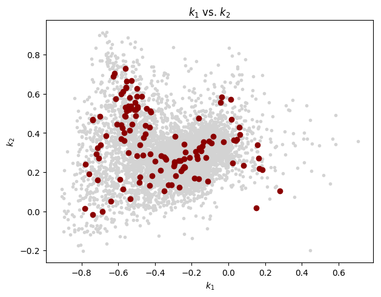
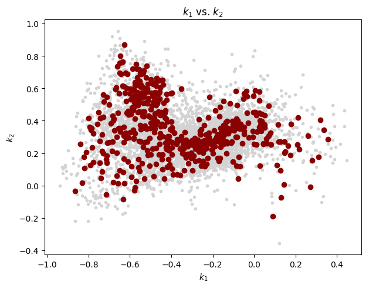
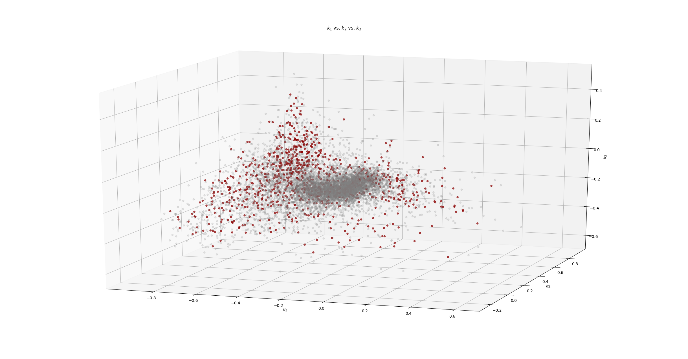

## Note

In this case, the source sounds files:
 
    $ ls -l ~/Desktop/MBARI/Soundscape/HumpbackSong_6_good_songs/
    ... 35M Feb 14  2018 HBSe_20161221T010133.wav
    ... 30M Feb 14  2018 HBSe_20161221T014717.wav
    ... 34M Feb 14  2018 HBSe_20161221T020427.wav
    ... 43M Feb 14  2018 HBSe_20170109T204800.wav
    ... 33M Feb 14  2018 HBSe_20170116T055614.wav
    ... 71M Feb 14  2018 HBSe_20170128T231621.wav
 
 are located outside of this repository.
 
## LPC analysis

    $ lpc -P 36 -W 45 -O 15 ~/Desktop/MBARI/Soundscape/HumpbackSong_6_good_songs/*.wav
    Number of classes: 1
    class 'HumpbackSong_6_good_songs': 6
      /Users/carueda/Desktop/MBARI/Soundscape/HumpbackSong_6_good_songs/HBSe_20161221T014717.wav
    lpaOnSignal: P=36 numSamples=15674431 sampleRate=32000 winSize=1440 offset=480 T=32653
    data/predictors/HumpbackSong_6_good_songs/HBSe_20161221T014717.prd: 'HumpbackSong_6_good_songs': predictor saved
    
      /Users/carueda/Desktop/MBARI/Soundscape/HumpbackSong_6_good_songs/HBSe_20170128T231621.wav
    lpaOnSignal: P=36 numSamples=36977463 sampleRate=32000 winSize=1440 offset=480 T=77034
    data/predictors/HumpbackSong_6_good_songs/HBSe_20170128T231621.prd: 'HumpbackSong_6_good_songs': predictor saved
    
      /Users/carueda/Desktop/MBARI/Soundscape/HumpbackSong_6_good_songs/HBSe_20170109T204800.wav
    lpaOnSignal: P=36 numSamples=22612312 sampleRate=32000 winSize=1440 offset=480 T=47106
    data/predictors/HumpbackSong_6_good_songs/HBSe_20170109T204800.prd: 'HumpbackSong_6_good_songs': predictor saved
    
      /Users/carueda/Desktop/MBARI/Soundscape/HumpbackSong_6_good_songs/HBSe_20161221T010133.wav
    lpaOnSignal: P=36 numSamples=18368474 sampleRate=32000 winSize=1440 offset=480 T=38265
    data/predictors/HumpbackSong_6_good_songs/HBSe_20161221T010133.prd: 'HumpbackSong_6_good_songs': predictor saved
    
      /Users/carueda/Desktop/MBARI/Soundscape/HumpbackSong_6_good_songs/HBSe_20170116T055614.wav
    lpaOnSignal: P=36 numSamples=17342609 sampleRate=32000 winSize=1440 offset=480 T=36128
    data/predictors/HumpbackSong_6_good_songs/HBSe_20170116T055614.prd: 'HumpbackSong_6_good_songs': predictor saved
    
      /Users/carueda/Desktop/MBARI/Soundscape/HumpbackSong_6_good_songs/HBSe_20161221T020427.wav
    lpaOnSignal: P=36 numSamples=18001105 sampleRate=32000 winSize=1440 offset=480 T=37500

## Codebook generation
    
    $ vq.learn -P 36 -e 0.0005 data/predictors/HumpbackSong_6_good_songs/*prd
     
Plot the general evaluation:

    $ cb.plot_evaluation.py data/codebooks/_/eps_0.0005.rpt.csv
           M  passes     DDprm          σ        inertia
    0      2       9  0.285415   1.453891  522828.495346
    1      4       9  0.236424   2.079603  457206.493195
    2      8      15  0.196693   3.558782  415913.646977
    3     16      14  0.167026   5.153438  384482.300009
    4     32      20  0.141351   7.154483  359349.556103
    5     64      19  0.121253   9.554444  342508.921965
    6    128      16  0.107120  12.136631  332027.907051
    7    256      17  0.096203  14.315932  324612.268032
    8    512      15  0.087421  16.705644  318889.487475
    9   1024      15  0.079596  19.233455  313963.162855
    10  2048      14  0.072313  22.115393  309482.011895

    

Cell cardinality and distortions for M=1024:
    
    $ cb.plot_cards_dists.py data/codebooks/_/eps_0.0005_M_1024.cbook.cards_dists.csv
        

As a scatter plot:

    $ cb.plot_cards_dists.py --scatter data/codebooks/_/eps_0.0005_M_1024.cbook.cards_dists.csv

    

Extract  k_1 and k_2 from the training vectors:

    $ for prd in data/predictors/HumpbackSong_6_good_songs/*.prd; do
      prd.show -k -r 1-2 $prd >> k1k2.csv
    done
    
and from the codebooks:

    $ for M in 0002 0004 0008 0016 0032 0064 0128 0256 0512 1024; do
        cb.show -r 1-2 data/codebooks/_/eps_0.0005_M_$M.cbook > data/codebooks/_/eps_0.0005_M_$M.cbook.kk.csv
    done

With the above set of reflection coefficients, let's generate a few "k_1 vs. k_2"
scatter plots:

    $ for M in 0002 0008 0032 0128 0512; do
        cb.plot_reflections.py k1k2.csv data/codebooks/_/eps_0.0005_M_$M.cbook.kk.csv
    done

(Note: A maximum of 8000 training vectors, randomly chosen in each case, are plotted.)

M=2:
 

M=8:

M=32:

M=128:

M=512:

Similar reflection coefficient inspection but now with 3 coefficients:
    
    $ prd.show -k -r 1-3 data/predictors/_/HBSe_20170128T231621.prd > data/predictors/_/HBSe_20170128T231621.prd.kkk.csv
    
    $ cb.show -r 1-3 data/codebooks/_/eps_0.0005_M_1024.cbook > data/codebooks/_/eps_0.0005_M_1024.cbook.kkk.csv
    
    $ cb.plot_reflections.py data/predictors/_/HBSe_20170128T231621.prd.kkk.csv data/codebooks/_/eps_0.0005_M_1024.cbook.kkk.csv
    df_training points = 77034
    df_training plotted points = 8000
    df_codebook points = 1024

## Cell shapes

See [P2/README.md](P2/README.md).