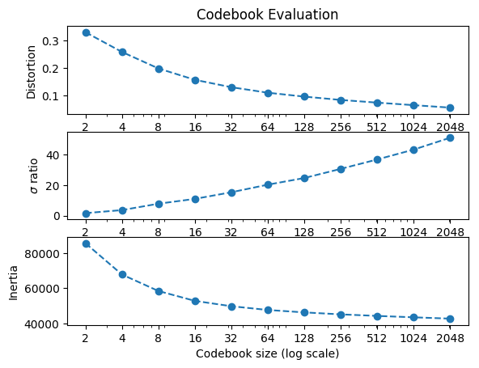
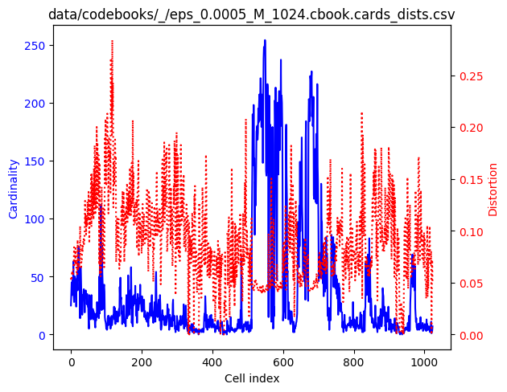
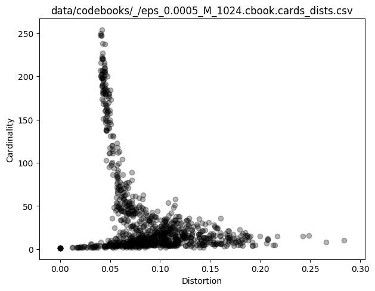
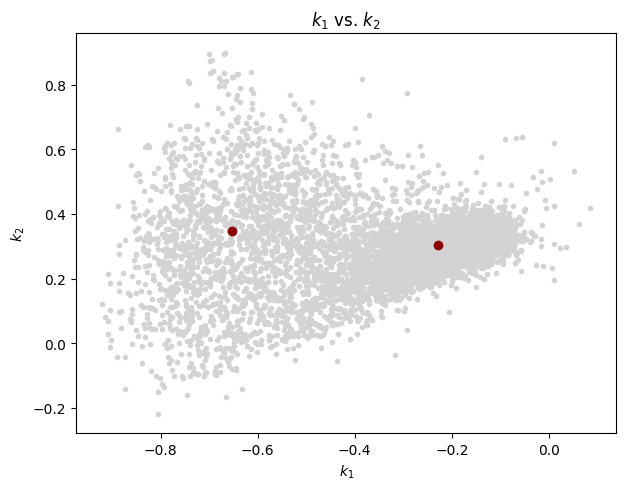
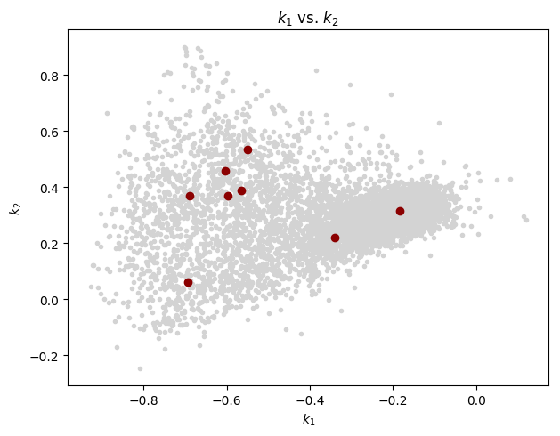
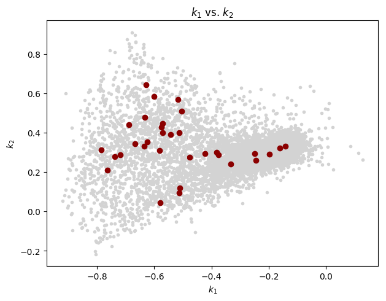
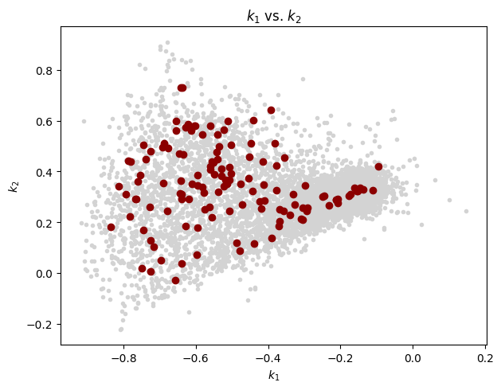
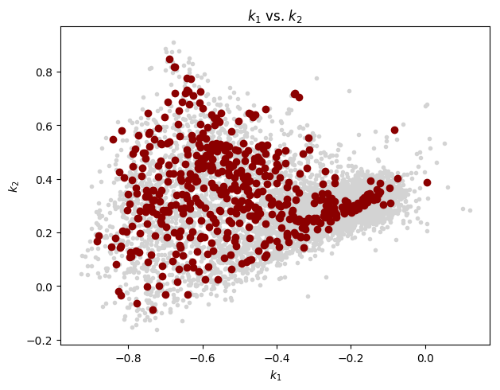
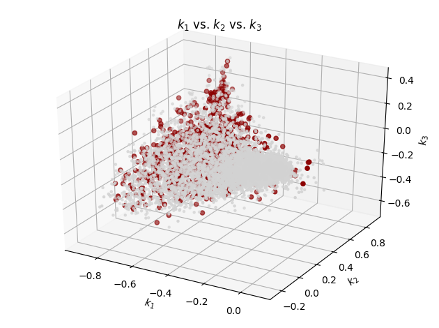

## LPC analysis

    $ lpc -P 36 -W 45 -O 15 HBSe_20161221T010133.wav
    Number of classes: 1
    class '': 1
      HBSe_20161221T010133.wav
    lpaOnSignal: P=36 numSamples=18368474 sampleRate=32000 winSize=1440 offset=480 T=38265
    data/predictors/_/HBSe_20161221T010133.prd: '': predictor saved

## Codebook generation
    
    $ vq.learn -P 36 -e 0.0005 data/predictors/_/HBSe_20161221T010133.prd
    
Plot the general evaluation:
    
    $ cb.plot_evaluation.py data/codebooks/_/eps_0.0005.rpt.csv
    
           M  passes     DDprm          σ       inertia
    0      2       7  0.329847   1.669760  85563.055636
    1      4      19  0.258477   3.662945  67812.819378
    2      8      26  0.198647   7.851806  58449.267547
    3     16      32  0.157429  11.032102  52835.579481
    4     32      16  0.130626  15.396460  49804.951420
    5     64      17  0.110648  20.375099  47672.295169
    6    128      17  0.096532  24.747489  46300.641095
    7    256      16  0.084483  30.756691  45173.663627
    8    512      15  0.074696  36.942795  44299.052234
    9   1024      14  0.065547  43.420272  43505.964302
    10  2048      12  0.056605  51.227322  42754.019571    
    
    

Cell cardinality and distortions for M=1024:
    
    $ cb.plot_cards_dists.py data/codebooks/_/eps_0.0005_M_1024.cbook.cards_dists.csv
        

As a scatter plot:

    $ cb.plot_cards_dists.py --scatter data/codebooks/_/eps_0.0005_M_1024.cbook.cards_dists.csv

    

Extract  k_1 and k_2 from the training vectors:

    $ prd.show -k -r 1-2 data/predictors/_/HBSe_20161221T010133.prd > data/predictors/_/HBSe_20161221T010133.prd.kk.csv
    
and from the codebooks:

    $ for M in 0002 0004 0008 0016 0032 0064 0128 0256 0512 1024; do
        cb.show -r 1-2 data/codebooks/_/eps_0.0005_M_$M.cbook > data/codebooks/_/eps_0.0005_M_$M.cbook.kk.csv
    done

With the above set of reflection coefficients, let's generate a few "k_1 vs. k_2"
scatter plots:

    $ for M in 0002 0008 0032 0128 0512; do
        cb.plot_reflections.py data/predictors/_/HBSe_20161221T010133.prd.kk.csv data/codebooks/_/eps_0.0005_M_$M.cbook.kk.csv
    done

(Note: A maximum of 8000 training vectors, randomly chosen in each case, are plotted.)

M=2:
 

M=8:

M=32:

M=128:

M=512:

Similar reflection coefficient inspection but now with 3 coefficients:
    
    $ prd.show -k -r 1-3 data/predictors/_/HBSe_20161221T010133.prd > data/predictors/_/HBSe_20161221T010133.prd.kkk.csv
    
    $ cb.show -r 1-3 data/codebooks/_/eps_0.0005_M_1024.cbook > data/codebooks/_/eps_0.0005_M_1024.cbook.kkk.csv
    
    $ cb.plot_reflections.py data/predictors/_/HBSe_20161221T010133.prd.kkk.csv data/codebooks/_/eps_0.0005_M_1024.cbook.kkk.csv
    df_training points = 38265
    df_training plotted points = 8000
    df_codebook points = 1024

