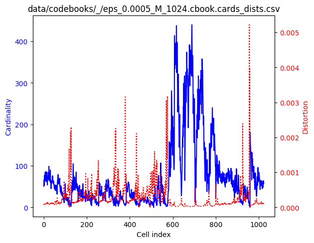
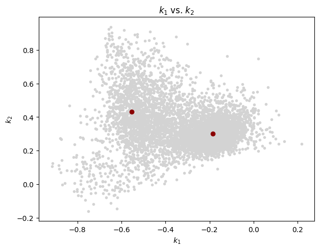
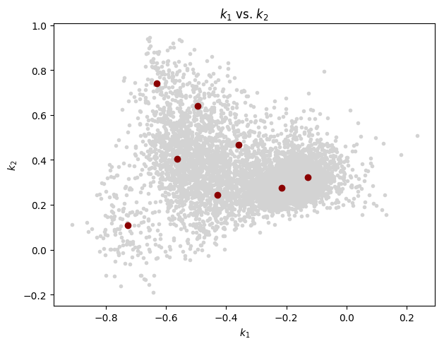
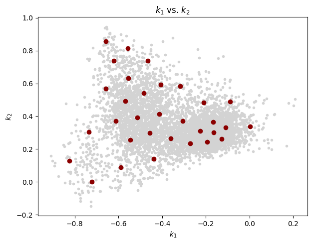
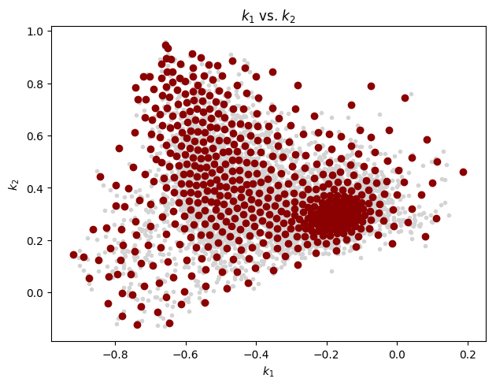
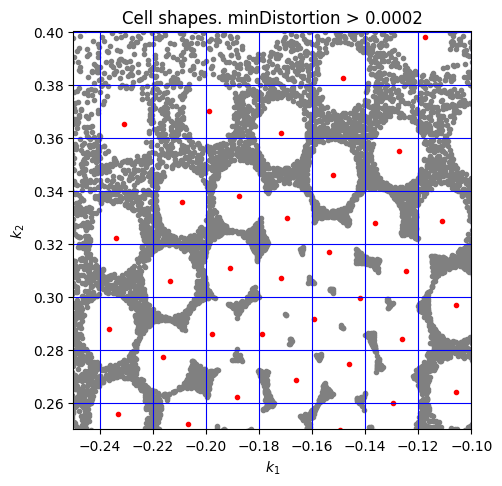
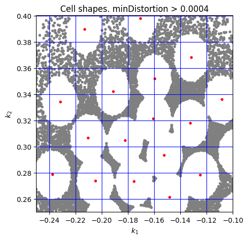
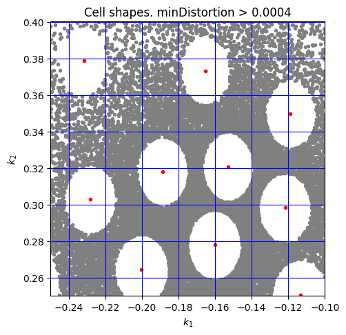

## Cell shapes

In this exercise we also inspect the shape of the clustering cells, also
in the style of Juang et al (1982).
We do this based on a 2-order linear prediction analysis to more directly
reflect the (k_1,k_2) bi-dimensional space.

We start with a similar set of plots as in other exercises and then add
the cell shapes.

## LPC analysis

    $ lpc -P 2 -W 45 -O 15 ../HBSe_20170128T231621.wav
    Number of classes: 1
    class '': 1
      ../HBSe_20170128T231621.wav
    lpaOnSignal: P=2 numSamples=36977463 sampleRate=32000 winSize=1440 offset=480 T=77034
    data/predictors/_/HBSe_20170128T231621.prd: '': predictor saved    

## Codebook generation
    
    $ vq.learn -P 2 -e 0.0005 data/predictors/_/HBSe_20170128T231621.prd
     
Plot the general evaluation:
    
    $ cb.plot_evaluation.py data/codebooks/_/eps_0.0005.rpt.csv
    
           M  passes     DDprm             σ       inertia
    0      2       8  0.039423      9.639393  84042.229567
    1      4      26  0.021740     15.283633  80579.338187
    2      8      28  0.011897     34.403979  78918.180990
    3     16      32  0.006583     64.590877  78066.615782
    4     32      24  0.003461    143.867670  77572.584686
    5     64      28  0.001760    297.612209  77306.416769
    6    128      28  0.000887    624.285187  77170.933938
    7    256      27  0.000441   1268.993827  77102.001851
    8    512      29  0.000215   2650.932634  77067.125780
    9   1024      22  0.000105   5403.584329  77050.133396
    10  2048      21  0.000048  11555.742511  77041.460352    
    

    

Cell cardinality and distortions for M=1024:
    
    $ cb.plot_cards_dists.py data/codebooks/_/eps_0.0005_M_1024.cbook.cards_dists.csv
        

Extract  k_1 and k_2 from the training vectors:

    $ prd.show -k -r 1-2 data/predictors/_/HBSe_20170128T231621.prd > data/predictors/_/HBSe_20170128T231621.prd.kk.csv
    
and from the codebooks:

    $ for M in 0002 0004 0008 0016 0032 0064 0128 0256 0512 1024; do
        cb.show -r 1-2 data/codebooks/_/eps_0.0005_M_$M.cbook > data/codebooks/_/eps_0.0005_M_$M.cbook.kk.csv
    done

With the above set of reflection coefficients, let's generate a few "k_1 vs. k_2"
scatter plots:

    $ for M in 0002 0008 0032 0128 0512; do
        cb.plot_reflections.py data/predictors/_/HBSe_20170128T231621.prd.kk.csv data/codebooks/_/eps_0.0005_M_$M.cbook.kk.csv
    done

(Note: A maximum of 8000 training vectors, randomly chosen in each case, are plotted.)

M=2:
 

M=8:

M=32:

M=128:

M=512:

**Cell shapes**

Finally, let's visualize the cell shapes in some codebooks.

In the following:

- gray points represent training vectors whose minimum distortion wrt to 
  corresponding codebook size is greater than the indicated threshold
- red dots are a subset of centroids from the codebook
  

minDistortion > 0.0002, M=256: 

    $ cb.plot_cell_shapes.py \
      data/predictors/_/HBSe_20170128T231621.prd.kk.csv \
      data/codebooks/_/eps_0.0005_M_0256.cbook.min_dists.csv \
      data/codebooks/_/eps_0.0005_M_0256.cbook.kk.csv \
      0.0002

minDistortion > 0.0004, M=128:

    $ cb.plot_cell_shapes.py \
      data/predictors/_/HBSe_20170128T231621.prd.kk.csv \
      data/codebooks/_/eps_0.0005_M_0128.cbook.min_dists.csv \
      data/codebooks/_/eps_0.0005_M_0128.cbook.kk.csv \
      0.0004

minDistortion > 0.0004, M=64:

    $ cb.plot_cell_shapes.py \
      data/predictors/_/HBSe_20170128T231621.prd.kk.csv \
      data/codebooks/_/eps_0.0005_M_0064.cbook.min_dists.csv \
      data/codebooks/_/eps_0.0005_M_0064.cbook.kk.csv \
      0.0004

