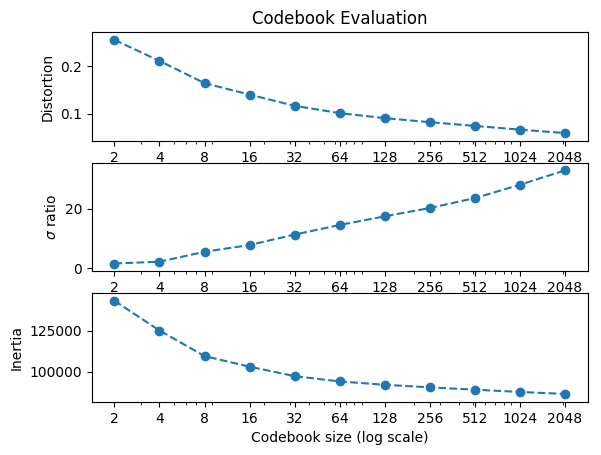
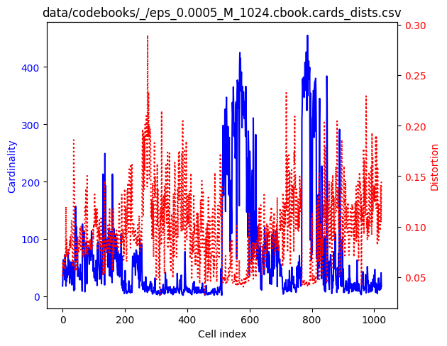
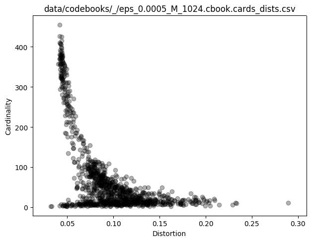
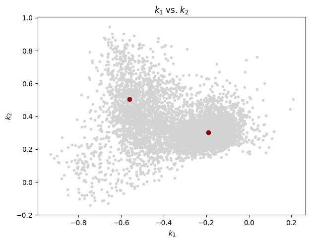
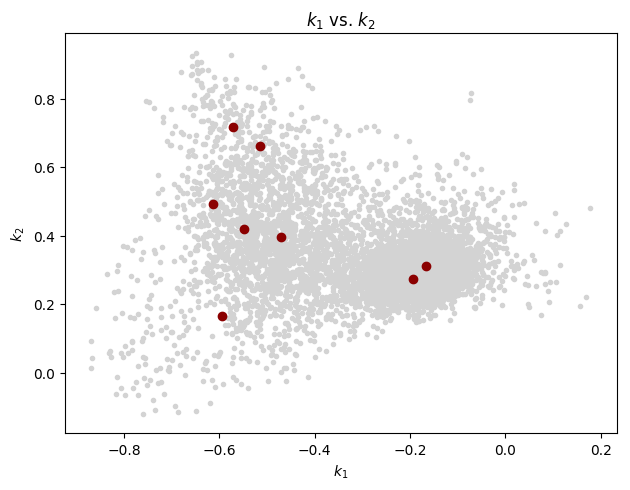
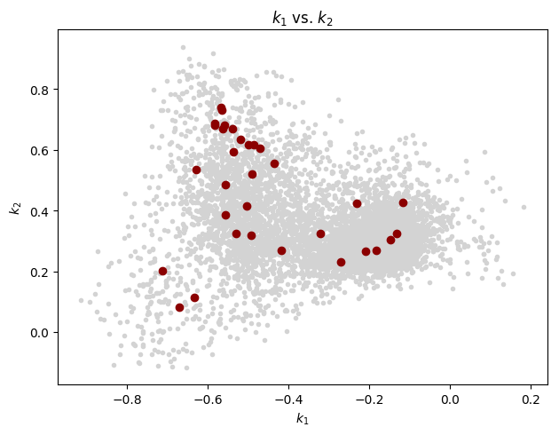
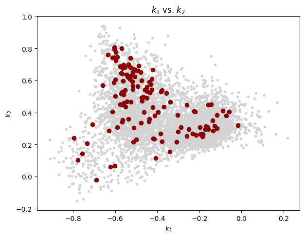
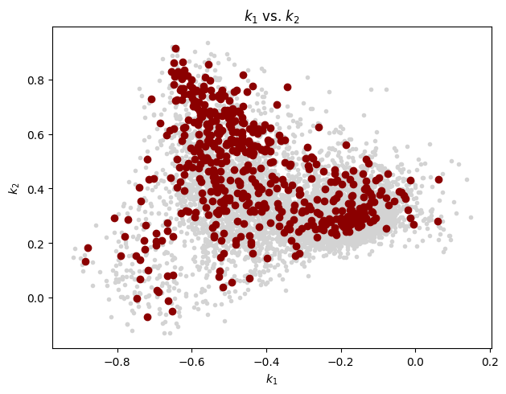
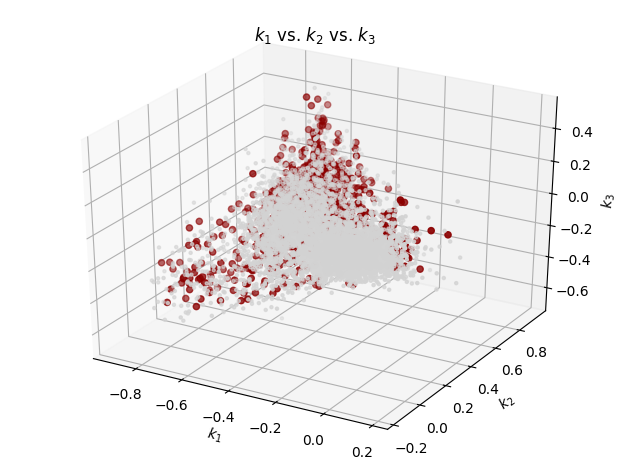

## LPC analysis

    $ lpc -P 36 -W 45 -O 15 HBSe_20170128T231621.wav
    Number of classes: 1
    class '': 1
      HBSe_20170128T231621.wav
    lpaOnSignal: P=36 numSamples=36977463 sampleRate=32000 winSize=1440 offset=480 T=77034
    data/predictors/_/HBSe_20170128T231621.prd: '': predictor saved

## Codebook generation
    
    $ vq.learn -P 36 -e 0.0005 data/predictors/_/HBSe_20170128T231621.prd
     
Plot the general evaluation:
    
    $ cb.plot_evaluation.py data/codebooks/_/eps_0.0005.rpt.csv
    
           M  passes     DDprm          σ        inertia
    0      2       7  0.255785   1.587956  143107.263731
    1      4       9  0.211432   2.192094  125029.021765
    2      8      27  0.164426   5.526398  109486.976613
    3     16      16  0.140328   7.775847  103058.072623
    4     32      13  0.116596  11.300068   97311.543605
    5     64      15  0.101224  14.506913   94083.550532
    6    128      16  0.090683  17.409458   92055.505677
    7    256      15  0.082132  20.192721   90490.788718
    8    512      16  0.074236  23.523729   89079.286266
    9   1024      16  0.066392  27.985164   87714.217618
    10  2048      13  0.059158  32.833571   86486.074742    

    

Cell cardinality and distortions for M=1024:
    
    $ cb.plot_cards_dists.py data/codebooks/_/eps_0.0005_M_1024.cbook.cards_dists.csv
        

As a scatter plot:

    cb.plot_cards_dists.py --scatter data/codebooks/_/eps_0.0005_M_1024.cbook.cards_dists.csv

    

Extract  k_1 and k_2 from the training vectors:

    $ prd.show -k -r 1-2 data/predictors/_/HBSe_20170128T231621.prd > data/predictors/_/HBSe_20170128T231621.prd.kk.csv
    
and from the codebooks:

    $ for M in 0002 0004 0008 0016 0032 0064 0128 0256 0512 1024; do
        cb.show -r 1-2 data/codebooks/_/eps_0.0005_M_$M.cbook > data/codebooks/_/eps_0.0005_M_$M.cbook.kk.csv
    done

With the above set of reflection coefficients, let's generate a few "k_1 vs. k_2"
scatter plots:

    $ for M in 0002 0008 0032 0128 0512; do
        cb.plot_reflections.py data/predictors/_/HBSe_20170128T231621.prd.kk.csv data/codebooks/_/eps_0.0005_M_$M.cbook.kk.csv
    done

(Note: A maximum of 8000 training vectors, randomly chosen in each case, are plotted.)

M=2:
 

M=8:

M=32:

M=128:

M=512:

Similar reflection coefficient inspection but now with 3 coefficients:
    
    $ prd.show -k -r 1-3 data/predictors/_/HBSe_20170128T231621.prd > data/predictors/_/HBSe_20170128T231621.prd.kkk.csv
    
    $ cb.show -r 1-3 data/codebooks/_/eps_0.0005_M_1024.cbook > data/codebooks/_/eps_0.0005_M_1024.cbook.kkk.csv
    
    $ cb.plot_reflections.py data/predictors/_/HBSe_20170128T231621.prd.kkk.csv data/codebooks/_/eps_0.0005_M_1024.cbook.kkk.csv
    df_training points = 77034
    df_training plotted points = 8000
    df_codebook points = 1024

## Cell shapes

See [P2/README.md](P2/README.md).