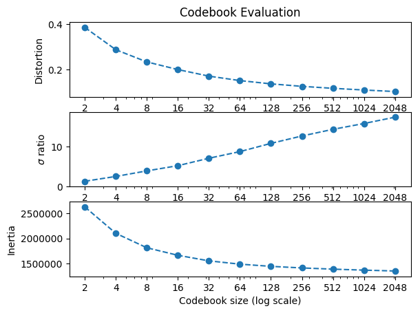
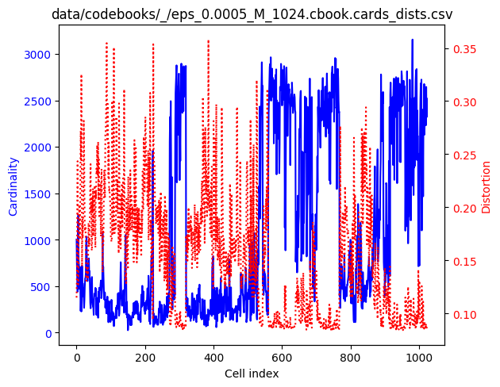
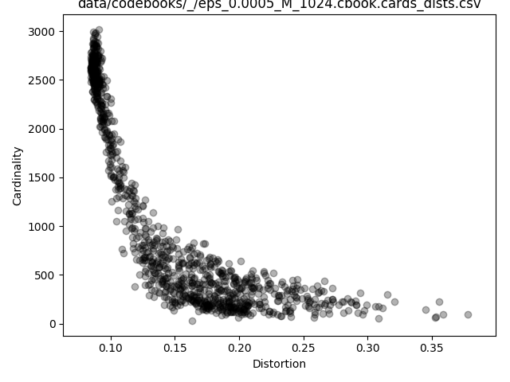
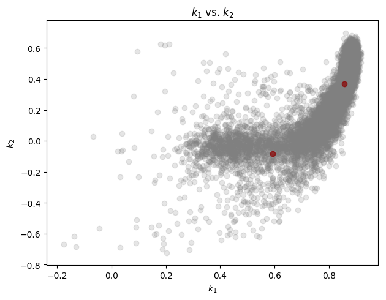
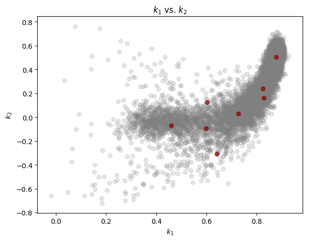
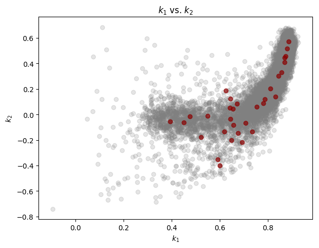
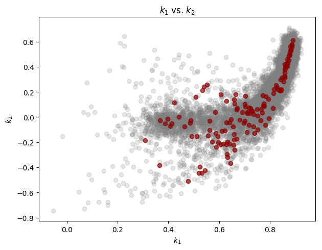
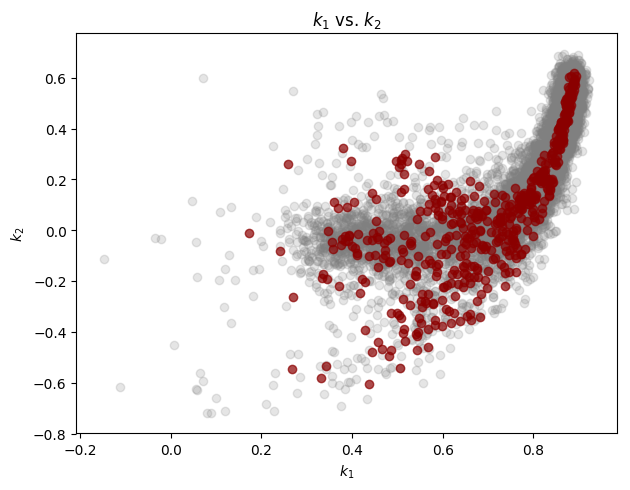
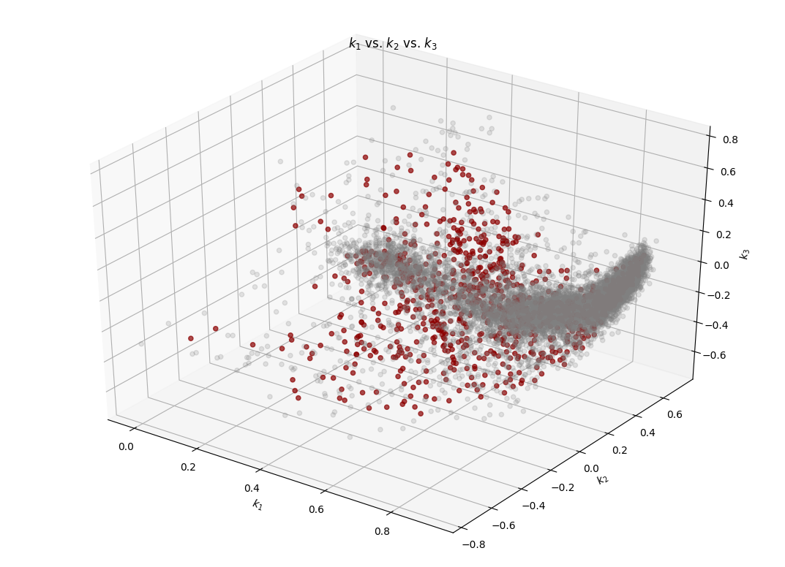

**Note**. In this case, the source sound file:
 
    532M ~/Downloads/MARS_20161221_000046_SongSession_16kHz_HPF5Hz/MARS_20161221_000046_SongSession_16kHz_HPF5Hz.wav
 
is located outside of this repository.
This sound has a 50 Db amplification (using Audacity) wrt to the one provided.

Also, the generated data is for the moment *not* included in the repo; 
only included are the resulting plots as referenced in this page. 
 
## LPC analysis

    $ lpc -P 36 ~/Downloads/MARS_20161221_000046_SongSession_16kHz_HPF5Hz/MARS_20161221_000046_SongSession_16kHz_HPF5Hz.wav
    Number of classes: 1
    class 'MARS_20161221_000046_SongSession_16kHz_HPF5Hz': 1
      /Users/carueda/Downloads/MARS_20161221_000046_SongSession_16kHz_HPF5Hz/MARS_20161221_000046_SongSession_16kHz_HPF5Hz.wav
    lpaOnSignal: P=36 numSamples=266117287 sampleRate=16000 winSize=720 offset=240 T=1108820
    data/predictors/MARS_20161221_000046_SongSession_16kHz_HPF5Hz/MARS_20161221_000046_SongSession_16kHz_HPF5Hz.prd: 'MARS_20161221_000046_SongSession_16kHz_HPF5Hz': predictor saved

## Codebook generation
    
1,108,820 training vectors.
     
    $ vq.learn -P 36 -e 0.0005 data/predictors/MARS_20161221_000046_SongSession_16kHz_HPF5Hz/MARS_20161221_000046_SongSession_16kHz_HPF5Hz.prd

Plot general evaluation:

    $ cb.plot_evaluation.py data/codebooks/_/eps_0.0005.rpt.csv
           M  passes     DDprm          σ       inertia
    0      2       9  0.386237   1.258410  2.628891e+06
    1      4      11  0.287822   2.472050  2.102332e+06
    2      8      17  0.233958   3.860611  1.814950e+06
    3     16      18  0.200205   5.168959  1.664952e+06
    4     32      18  0.171203   7.026399  1.554185e+06
    5     64      14  0.151517   8.694152  1.488529e+06
    6    128      17  0.137004  10.754301  1.444406e+06
    7    256      15  0.126080  12.613927  1.412817e+06
    8    512      14  0.117340  14.281844  1.388907e+06
    9   1024      14  0.109883  15.773080  1.369188e+06
    10  2048      14  0.103179  17.328352  1.351842e+06

    

Cell cardinality and distortions for M=1024:
    
    $ cb.plot_cards_dists.py data/codebooks/_/eps_0.0005_M_1024.cbook.cards_dists.csv
        

As a scatter plot:

    $ cb.plot_cards_dists.py --scatter data/codebooks/_/eps_0.0005_M_1024.cbook.cards_dists.csv

    

Extract  k_1 and k_2 from the training vectors:

    $ prd.show -k -r 1-2 data/predictors/MARS_20161221_000046_SongSession_16kHz_HPF5Hz/MARS_20161221_000046_SongSession_16kHz_HPF5Hz.prd > k1k2.csv
    
and from the codebooks:

    $ for M in 0002 0004 0008 0016 0032 0064 0128 0256 0512 1024; do
        cb.show -r 1-2 data/codebooks/_/eps_0.0005_M_$M.cbook > data/codebooks/_/eps_0.0005_M_$M.cbook.kk.csv
    done

With the above set of reflection coefficients, let's generate a few "k_1 vs. k_2"
scatter plots:

    $ for M in 0002 0008 0032 0128 0512; do
        cb.plot_reflections.py k1k2.csv data/codebooks/_/eps_0.0005_M_$M.cbook.kk.csv
    done

(Note: A maximum of 8000 training vectors, randomly chosen in each case, are plotted.)

M=2:
 

M=8:

M=32:

M=128:

M=512:

Similar reflection coefficient inspection but now with 3 coefficients,
and with the M=1024 codebook:
    
    $ prd.show -k -r 1-3 data/predictors/MARS_20161221_000046_SongSession_16kHz_HPF5Hz/MARS_20161221_000046_SongSession_16kHz_HPF5Hz.prd > kkk.csv
    
    $ cb.show -r 1-3 data/codebooks/_/eps_0.0005_M_1024.cbook > data/codebooks/_/eps_0.0005_M_1024.cbook.kkk.csv
    
    $ cb.plot_reflections.py kkk.csv data/codebooks/_/eps_0.0005_M_1024.cbook.kkk.csv
    df_training points = 1108820
    df_training plotted points = 8000
    df_codebook points = 1024

